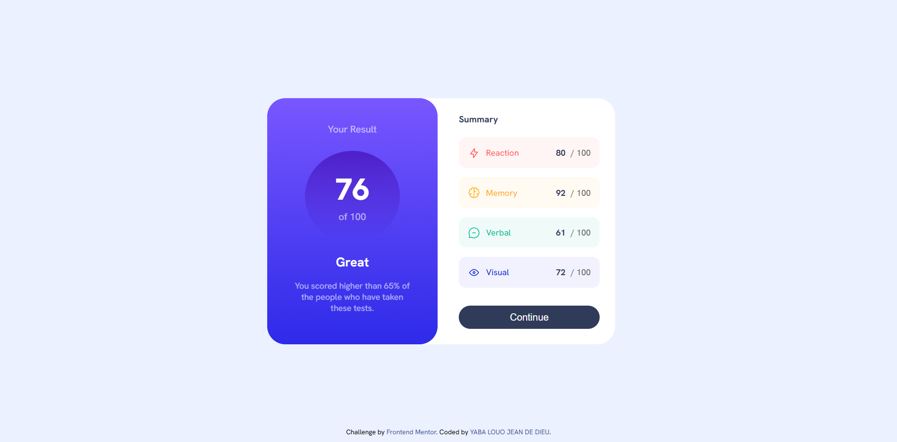

# Frontend Mentor - Results summary component solution

This is a solution to the [Results summary component challenge on Frontend Mentor](https://www.frontendmentor.io/challenges/results-summary-component-CE_K6s0maV). Frontend Mentor challenges help you improve your coding skills by building realistic projects.

## Table of contents

- [Overview](#overview)
  - [Screenshot](#screenshot)
  - [Links](#links)
- [My process](#my-process)
  - [Built with](#built-with)
- [Author](#author)

## Overview

### Screenshot

### Links

- Solution URL: [https://github.com/victoire20/results-summary-component](https://github.com/victoire20/results-summary-component)
- Live Site URL: [https://victoire20.github.io/results-summary-component](https://victoire20.github.io/results-summary-component)

## My process

### Built with

- Semantic HTML5 markup
- CSS custom properties
- Flexbox
- Mobile-first workflow
- [Styled Components](https://styled-components.com/) - For styles

## Author

- Website - [Github Page](https://github.com/victoire20)
- Frontend Mentor - [@victoire20](https://www.frontendmentor.io/profile/victoire20)
